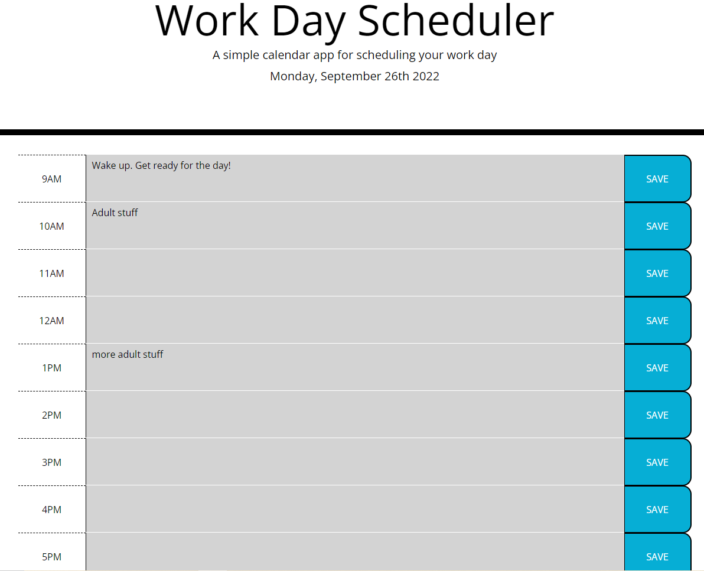

# 05 Third-Party APIs: Work Day Scheduler

This site is designed to let you plan events for your day, basically this site is a planner. Once you load
the page, at the top you will see the current date, then you will see timeblocks for 9am to 5pm (normal work hours)
that are color coded depending on which hours have already passed, the current hour, and finally the future hours.
You can enter text into these boxes and save it to local storage by pressing the save button. The data will persist
even if you leave the site. 

## Deployed Page
[URL Of Deployed Application](https://sblangeres1.github.io/work-day-scheduler/)

